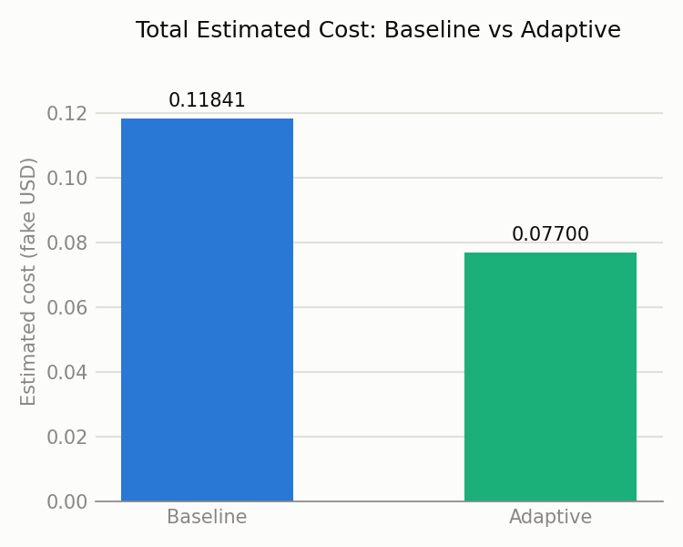
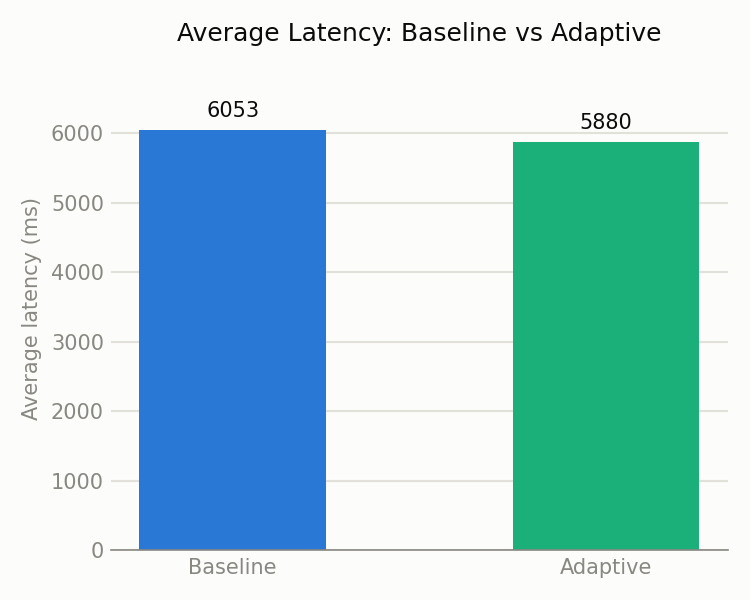

# CostQual-Router Prototype -- Comparison Report

## Latency

| System | Total (ms) | Average (ms) |
|---|---|---|
| Baseline | 363184.1 | 6053.1 |
| Adaptive | 352827.2 | 5880.5 |

## Estimated cost

| System | Total estimated cost |
|---|---|
| Baseline | 0.118408 |
| Adaptive | 0.077003 |

## Cache hit rate by category (adaptive only)

| Category | Hits | Total | Hit rate |
|---|---|---|---|
| complex | 0 | 10 | 0% |
| duplicate | 8 | 15 | 53% |
| paraphrase | 6 | 15 | 40% |
| simple | 0 | 10 | 0% |
| unique | 0 | 10 | 0% |

Overall cache hit rate: **23%**

## Tier usage distribution (adaptive, cache misses only)

| Tier | Share of cache-miss queries |
|---|---|
| large | 22% |
| medium | 35% |
| small | 43% |
## Quality sanity check

Of the queries where the adaptive router used a smaller model than the baseline **and** produced a different answer, 10 were sampled and judged (by the baseline model) for whether the smaller model's answer was still acceptable: **7/10 passed (70%)**. This is a lightweight sanity check, not a rigorous eval -- see `quality_check_results.csv` for the sampled question/answer pairs and `prototype_plan.md` Step 9 for scope.

## Charts

## Interpretation

The adaptive system (semantic cache + complexity-based model routing) reduced estimated cost by **35%** and average latency by **3%** compared to the always-on baseline, with a **23%** overall cache hit rate driven mostly by the duplicate and paraphrase query categories -- confirming that semantic caching catches near-duplicate questions, not just exact repeats, without needing a larger model for queries that don't require one.
